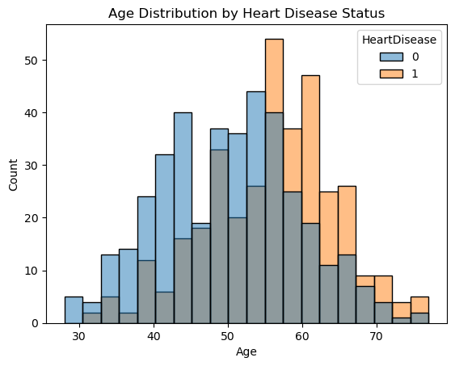
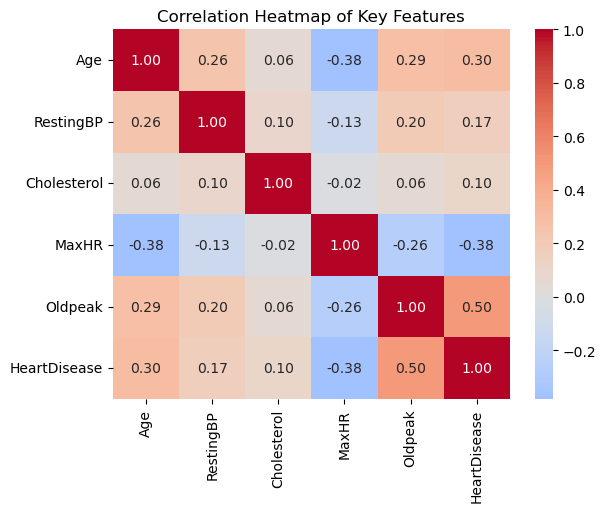
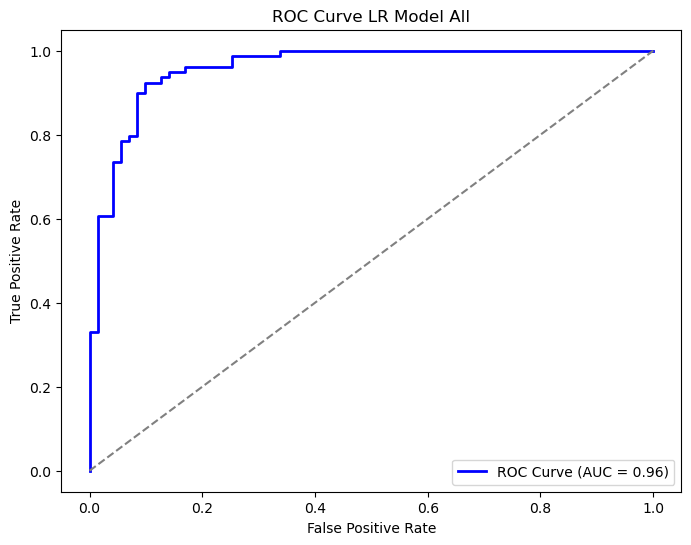
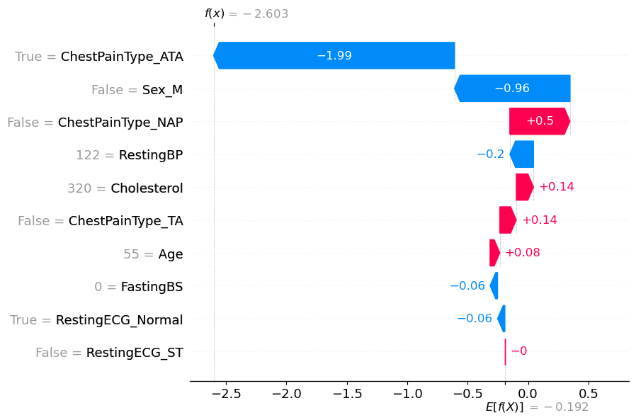
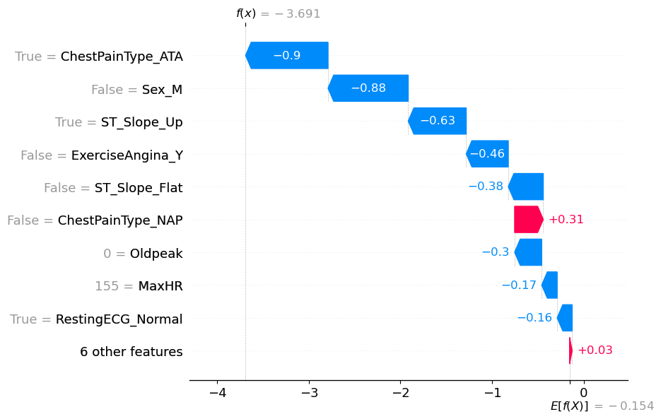
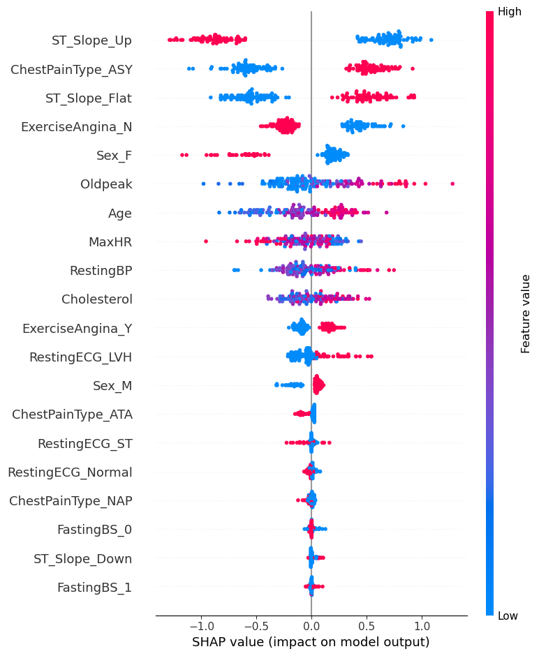

# PROJECT OVERVIEW

## Business Problem

Through the use of machine learning models, can heart failure be accurately predicted using only demographic and baseline pre-stress test data without the need to conduct exercise stress tests?

## Why Address this Problem?

### Potential Value to Predict Heart Failure Without Stress Tests

Early screening using only basic patient data could help identify high-risk patients who should be prioritized for stress tests. This could make heart disease screening more accessible, especially in resource-limited settings

### Value for the Patient

Stress tests can be physically demanding, especially for patients who are at greater medical risk to develop arrythmias or a symptomatic cardiac event during the test. Predicting heart failure using baseline data reduces the physical and emotional burden associated with the investigation of a heart condition, and also shorten the time to diagnose the problem; thereby, improving the efficiency of the process.

Earlier identification of at-risk individuals using baseline data enables proactive lifestyle changes or treatments, which potentially reduces or avoids the progression of heart disease through timely interventions.

Furthermore, for Canadians living in remote, rural, or other underserved areas where exercise stress testing might not be readily available, patients could receive initial diagnoses through their primary care providers or other similar services, thereby, potentially improving healthcare access by virtue of identifying cardiac disease through routine physical examination.

### Value for the Healthcare Provider

For healthcare providers – physicians in particular – a reduction in the need for noninvasive cardiac diagnostic tests (NITs) improves their efficiency in the management of patients. Instead, physicians can use baseline data models as a fast and efficient preliminary screening tool, which saves time for them to focus on more acute cases. Diagnosing with straightforward physical exam data reduces the need for resource-intensive testing for lower-risk patients.

Developing of an ML model for heart failure prediction offers a layer of data-driven insights to support clinical decision making. Finding the best and most responsive models could further stratify patients based on risk features, which subsequently, improves quality of care provided by physicians.

Due to the accessibility of physical exam data of patients, the application of ML models to demographic, baseline blood work and ECG data could be integrated into electronic health records (EHRs), which enables the potential for notable scalability and risk predictions.

### Value for the Healthcare System

In Ontario alone, approximately 500,000 NITs are performed annually with direct costs totaling C$300M per year. More than half of these tests are exercise stress tests. Despite this cost, exercise stress tests are an effective low-cost way to assess heart disease with an approximate cost ranging from C$100-300 per test. In comparison to the acute management of coronary artery disease (CAD) and other cardiac conditions, performing these noninvasive cardiac diagnostic tests (NITs) were associated with a 12% reduction in downstream costs when compared to cases in which no NITs were performed.

As such, uncovering opportunities to reduce the overuse of NITs for the diagnosis of CAD without eroding the quality of cardiac care services would offer notable financial and logistical benefits as Canadian provinces and territories address ongoing health system pressures.

## Data Collection

The Heart Failure Prediction dataset consists of 12 features (variables):

| Category | Features |
|----------|-----------|
| Demographic | Age, Sex |
| Baseline / Pre-Stress Test | ChestPainType, RestingBP, Cholesterol, FastingBS, RestingECG |
| Stress Test | MaxHR, ExerciseAngina, Oldpeak, ST_Slope |
| Target | HeartDisease |

The dataset has been categorized to appropriately address our business problem:
- Age and Sex are Demographic data
- ChestPainType, RestingBP, Cholesterol, FastingBS, and RestingECG are Baseline / Pre-Stress Test data
- MaxHR, ExerciseAngina, Oldpeak, and ST_Slope are Stress Test data
- HeartDisease is the clinical finding/result for the patient subjects
- Based on the splitting of the dataset to Demographic, Baseline, and Stress Test data, we then proceeded to deploy the models using the following method:
  - Running the models using only the Demographic and Baseline Data
  - Running the models using the entire dataset
  - This approach enabled us to compare the performance of baseline data alone in comparison to stress test data

## Data Cleaning

- Overall, the dataset was quite clean
- There were no missing values and no null values
- Cholesterol and RestingBP had zero values (130 values with zero values were removed), which were eliminated from the dataset.

## Exploratory Data Analysis (EDA)

### 1. Gender Distribution

- The dataset reveals a gender imbalance, with a male majority
- Men have higher representation in both heart disease and no-heart-disease cases
- Women are less represented overall, which may impact the generalizability of the model

### 2. Age Distribution

- Heart disease prevalence is highest among individuals aged 50-65, which aligns with known risk factors for heart conditions in this age range
- Younger individuals (30-40 years old) exhibit lower heart disease rates
- Older populations (65+) show fewer cases, likely due to fewer samples in the dataset for this age group

### 3. Feature Correlation Heatmap

- Oldpeak (ST depression induced by exercise) shows the strongest positive correlation (0.50) with heart disease, suggesting its significant predictive power
- MaxHR (maximum heart rate achieved) has a negative correlation (-0.38) with heart disease, implying that lower maximum heart rates may indicate heart disease
- Age demonstrates a moderate positive correlation (0.30) with heart disease

## Models

We conducted our experiment using the models listed below. To optimize each model, we employed GridSearch for hyperparameter tuning in two phases. In the first phase, we utilized only the baseline features. In the second phase, we incorporated all available features.

### Logistical Regression

- Two logistic regression classifier models were built to compare the contribution of stress test variables with baseline only variables
- Both models were tuned using a grid search cross-validation method to select the best parameters. The following parameters were explored: C (regularization strength), Penalty (Lasso regularization vs Ridge regularization) and Solvers (liblinear vs saga)
  - For Model 1: Baseline Only best model in terms of accuracy had the following parameters: {'clf__C': 1.0, 'clf__penalty': 'l1', 'clf__solver': 'liblinear'}. The mean accuracy was 84%
  - For Model 2: Baseline Only best model in terms of accuracy had the following parameters: {'clf__C': 0.5, 'clf__penalty': 'l2', 'clf__solver': 'liblinear'}. The mean accuracy was 84%

   

   

### XGBoostfigures

XGBoost (Extreme Gradient Boosting) uses an ensemble of decision trees to make predictions. It builds trees sequentially, where each new tree corrects the errors made by the previous ones, improving overall accuracy. For hypertuning the model, we experimented with the below parameters:

- n_estimators: The number of boosting rounds or trees to build in the model
- max_depth: The maximum depth of each decision tree, controlling model complexity and overfitting
- learning_rate: A factor that reduces the contribution of each tree, controlling the step size in the boosting process
- subsample: The fraction of training data used for fitting each individual tree to prevent overfitting
- colsample_bytree: The fraction of features (columns) used randomly for each tree to improve generalization and reduce overfitting

And the evaluation metric used is log loss.

### Neural Network

We developed two neural network models with a sequential architecture consisting of:

- First dense layer (64 neurons) with LeakyReLU activation
- Batch normalization layer for training stability
- Second dense layer (32 neurons) with LeakyReLU activation
- Dropout layer (0.3) to prevent overfitting
- Output layer with sigmoid activation for binary classification

Both models were optimized using grid search cross-validation to explore the following parameters:

- neurons: Number of neurons in the hidden layers [64, 128]
- activation: Type of activation function [relu, leaky_relu, tanh]
- optimizer: Learning algorithm [adam, rmsprop]
- batch_size: Mini-batch size for training [16, 32]
- epochs: Number of training iterations [20, 50]

For Model 1: Baseline Only (using demographic and pre-stress test features) best model had the following parameters: {'batch_size': 16, 'epochs': 50, 'model__activation': 'leaky_relu', 'model__neurons': 64, 'optimizer': 'adam'}. The mean accuracy was 77% with 90% recall.

For Model 2: Complete features model achieved 91% accuracy and 92% recall with the same parameters, demonstrating the value of including stress test data.

## Findings

We found that utilizing all features provided better accuracy than only using baseline data across all models in our experiment.

| Model | Using baseline features |  | Using all features |  |
|-------|------------------------|--|-------------------|--|
| | Test Accuracy | Test Recall | Test Accuracy | Test Recall |
| Logistic Regression | 76% | 77% | 85% | 83% |
| XGBoost | 81% | 77% | 92% | 89% |
| Neural Network | 77% | 90% | 91% | 92% |

- Off all the models, the best model for predicting heart disease is XGBoost using all features and with parameters colsample_bytree=0.8, learning_rate=0.1, max_depth=5, n_estimators=50, and subsample=0.8
- Using SHAP on our best model to determine how each feature contributes to the prediction, we see that stress test features such as ST_Slope, ChestPainType, and ExerciseAngina_N are the most significant; therefore, reaffirming their clinical relevance.

  

Although using all features provides the best accuracy and recall scores, the best model using only baseline data still yielded accuracy and recall scores of 80 and 79, respectively. For Canadians who face challenges in accessing exercise stress testing, diagnosis through routine physical examination can still be performed, albeit with lower accuracy and recall scores.

## REFLECTIONS

This section outlines our team's collective reflections regarding our experience from this project. These insights are also detailed in our video presentation.

### 1. What did you learn?

#### Stress Testing is Beneficial and Recommended in the Investigation of Cardiac Issues

Although we found the sole use of demographic and baseline pre-stress test data provides a reasonable foundation for predicting heart disease, identifying heart disease is best done by incorporating exercise stress testing.

#### Model Behaviour

Relative to the other two models used, XGBoost performed the best on this dataset when all the data was used and shows robust predictive ability. Neural Networks can model complex relationships but require careful tuning and computational resources for optimal performance.

#### Metrics Interpretation

While we certainly want to ensure accuracy by identifying True Positives, we recognized the risk of False Negatives would be most significant because this subset would be misdiagnosed, and therefore, would not receive treatment (i.e. patients who are informed they do not have heart disease when they actually have heart disease). Consequently, minimizing false negatives was top-of-mind thus we also looked at Recall as well.

### 2. What challenges did you face?

#### Feature Encoding

Transforming categorical data, such as ChestPainType such that the data can run through the ML models while still preserve interpretability required additional steps, namely one-hot encoding

#### Tackling a New Model

We included XGBoost in our experiment, despite only discussing the concept of boosting in class (no coding/lab work), because our research indicated it is highly effective for healthcare classification. We aimed to leverage industry-proven models beyond those we had learned in the curse, ensuring we utilized the best tools available for our analysis.

#### Managing Other Aspects of the ML Production

It is always a challenge to complete projects successfully on time, on budget, and meet the objectives that are outlined from the beginning. Staying aligned with the underlying business problem throughout the project and understanding how to tailor our findings to different audiences who would be interested in our findings requires thoughtful communication so that our project is relevant for them.

### 3. How did you overcome those challenges?

#### Explainability

Apply SHAP values to enhance the model interpretability of the NN model

#### Feature Engineering

We employed one-hot encoding for categorical variables and normalized numerical features to ensure compatibility across the 3 models we deployed

#### Tackling a New Model

There is plenty of documentation on machine learning models available online. We were able to go through the documentation and understand the overall concept of the model and the parameters we can experiment with using Gridsearch. Trying out new models isn't as intimidating now given the foundational knowledge we have developed in class. This course has boosted our confidence and deepened our understanding of machine learning.

### 4. If you had more time, what would you add?

#### Incorporate Additional Features

Perhaps the incorporation of additional demographic and/or baseline pre-stress test data in the ML models could improve predictability of heart disease. Variables such as family history, BMI, geography, socioeconomic status, etc. has significant influence on cardiac health.

#### Explore More ML Models

Given more time, we could have explored additional models like KNN, Random Forest, and Support Vector Machines (SVM) to see how they perform. We could also have added more layers (e.g. dropout layers, batch normalization) to our neural network to capture complex patterns. However, it's important to balance model complexity and losing explainability which is very important for healthcare cases.

#### Generalize through the Use of External Datasets

Testing the best models on external datasets would validate the ML models we deployed and establish greater credibility for physicians to experiment in the real world.

### 5. What strengths do you bring to a team environment?

#### Holistic Problem-Solving Approach

We combined our domain knowledge, technical expertise, and the individual learning we gained through the DSI program to address the many problems from multiple angles, which ensured that project solutions are technically sound, strategically aligned with business goals, and feasible for implementation

#### Collaborative Team Approach

We discussed any differences in the business and technical approaches effectively. Our conversations were always respectful and collegial. Any disagreements we experienced were resolved constructively, and overall, we had a positive team environment.

#### Proactivity and Initiative

We took the initiative to identify potential roadblocks reasonably early and suggest innovative solutions to keep projects on track. We took steps to proactively manage our project so that delays are minimized and team productivity is maximized.

#### Mindful to Address the Business Problem

Although we were ambitious to apply the new ML skills we learned from the program, our focus was centered on addressing the business problem. Part of this process includes being able to communicate these complex results clearly and effectively to stakeholders that, in this case, includes administrative managers, researchers, and healthcare providers.
